# 🎫 Advanced Event Ticketing Customer Support Chatbot

<div align="center">


<h3>🚀 An intelligent, domain-specific chatbot powered by fine-tuned transformer models with advanced NER and spell correction for seamless event ticketing support</h3>

[Live Demo](https://advanced-event-ticketing-customer-support-chatbot.streamlit.app/) • [DistilGPT2 Model](https://huggingface.co/IamPradeep/AETCSCB_OOD_IC_DistilGPT2_Fine-tuned) • [Classifier Model](https://huggingface.co/IamPradeep/Query_Classifier_DistilBERT)


</div>

---

## 📋 Table of Contents

- [Overview](#-overview)
- [Key Features](#-key-features)
- [System Architecture](#-system-architecture)
- [Model Details](#-model-details)
- [Installation](#-installation)
- [Usage](#-usage)
- [Training Pipeline](#-training-pipeline)
- [Performance Metrics](#-performance-metrics)
- [Demo](#-demo)
- [Project Structure](#-project-structure)
- [License](#-license)
- [Acknowledgments](#-acknowledgments)

---

## 🌟 Overview

The **Advanced Event Ticketing Customer Support Chatbot** is a sophisticated AI-powered solution designed to handle customer inquiries related to event ticketing. Built with a multi-model architecture, this system features **query validation**, **spell correction**, **intelligent query classification**, **advanced entity extraction with GLiNER**, and **contextually relevant response generation**.

### 🎯 What Makes This Special?

This system employs a rigorous 5-step processing pipeline to ensure accurate and efficient responses. By validating inputs early and leveraging NLP models like **DistilGPT2** and **GLiNER**, it achieves high accuracy while gracefully handling out-of-domain queries and spelling errors.

---

## ✨ Key Features

<table>
<tr>
<td width="50%">

### 🧠 Intelligent Query Classification
- **DistilBERT-based classifier** distinguishes between in-domain and out-of-domain queries
- **99.96% accuracy** on validation set
- Graceful handling of off-topic requests

</td>
<td width="50%">

### 💬 Natural Response Generation
- **Fine-tuned DistilGPT2** for domain-specific responses
- Streaming text generation for real-time interaction
- Professional, context-aware replies

</td>
</tr>
<tr>
<td width="50%">

### 🏷️ Advanced Named Entity Recognition
- **GLiNER model** for zero-shot entity extraction
- Automatic detection of events, cities, locations, and venues
- Dynamic placeholder replacement with confidence thresholds

</td>
<td width="50%">

### 📏 Query Length Validation
- **First check** before any processing
- Automatic query length checking (max 128 tokens)
- User-friendly error messages for oversized queries
- Prevents unnecessary computation on invalid queries

</td>
</tr>
<tr>
<td width="50%">

### ✏️ Automatic Spell Correction
- **T5-based spell corrector** for input preprocessing
- Applied only after query validation passes
- Handles typos and misspellings seamlessly
- Improves query understanding accuracy

</td>
<td width="50%">

### 🎨 Beautiful UI/UX
- **Streamlit-powered interface**
- Chat-style conversation flow
- Example queries for quick start
- Elegant Tiempos font styling

</td>
</tr>
</table>

---

## 🏗️ System Architecture

```mermaid
graph TB
    A[👤 User Input] --> B{📏 Query Length Check}
    B -->|Too Long| C[⚠️ Error Message]
    B -->|OK| D[✏️ Spell Corrector]
    D --> E{🔍 DistilBERT Classifier}
    E -->|Out-of-Domain| F[🚫 Polite Fallback Response]
    E -->|In-Domain| G[🏷️ GLiNER NER Processing]
    G --> H[🤖 DistilGPT2 Response Generation]
    H --> I[🔄 Placeholder Replacement]
    I --> J[💬 Final Response]
    C --> J
    F --> J
    
    style A fill:#e1f5fe
    style B fill:#f3e5f5
    style C fill:#ffcdd2
    style D fill:#fff9c4
    style E fill:#fff3e0
    style F fill:#ffebee
    style G fill:#e8eaf6
    style H fill:#e8f5e9
    style I fill:#fce4ec
    style J fill:#e0f2f1
```



### Component Breakdown

| Component | Model/Technology | Purpose |
|-----------|-----------------|---------|
| **Query Validator** | DistilGPT2 Tokenizer | Query length validation (max 128 tokens) |
| **Spell Corrector** | oliverguhr/spelling-correction-english-base | Input text correction and normalization |
| **Query Classifier** | DistilBERT (fine-tuned) | Binary classification for OOD detection |
| **Response Generator** | DistilGPT2 (fine-tuned) | Domain-specific response generation |
| **Entity Extractor** | GLiNER (gliner_small-v2.5) | Zero-shot entity extraction for events/locations |
| **Frontend** | Streamlit | Interactive web interface |
| **Deployment** | Streamlit Cloud | Cloud hosting |

---

## 🤖 Model Details

### 1️⃣ Query Length Validator

<details>
<summary><b>Click to expand details</b></summary>

**Tokenizer:** DistilGPT2 Tokenizer (same as response generator)

**Purpose:** Validates query length before any processing to ensure efficient resource usage.

**Configuration:**
```python
max_tokens = 128
tokens = query_tokenizer.encode(query, add_special_tokens=True)
token_count = len(tokens)
if token_count > max_tokens:
    return None, "⚠️ Your question is too long..."
```

**Benefits:**
- Prevents unnecessary spell correction on invalid queries
- Saves computational resources
- Provides immediate user feedback
- Ensures model doesn't receive oversized inputs

</details>

### 2️⃣ Spell Corrector: T5-based Model

<details>
<summary><b>Click to expand details</b></summary>

**Model:** `oliverguhr/spelling-correction-english-base`

**Purpose:** Automatically corrects spelling errors and typos in user queries after query validation.

**Features:**
- Text-to-text generation pipeline
- Handles common spelling mistakes
- Preserves query intent while fixing errors
- Maximum output length: 256 tokens

**Example:**
```
Input:  "How do I cancle my tiket?"
Output: "How do I cancel my ticket?"
```

</details>

### 3️⃣ Entity Extractor: GLiNER

<details>
<summary><b>Click to expand details</b></summary>

**Model:** `gliner-community/gliner_small-v2.5`

**Purpose:** Zero-shot Named Entity Recognition for extracting event-related entities.

**Configuration:**
```python
labels = ["event", "city", "location", "concert", "festival", "show", "match", "game", "venue"]
threshold = 0.4  # Confidence threshold for entity extraction
```

**Key Features:**
- Zero-shot capability (no training required for new entity types)
- Lightweight and fast inference
- Flexible label definitions
- Excellent handling of domain-specific entities

**Example:**
```
Input:  "How can I upgrade my ticket for the Coldplay concert in Mumbai?"
Output: {
    "event": "Coldplay concert",
    "city": "Mumbai"
}
```

</details>

### 4️⃣ Response Generator: DistilGPT2

<details>
<summary><b>Click to expand training details</b></summary>

**Base Model:** `distilgpt2`

**Training Configuration:**
```python
TrainingArguments(
    output_dir="./results",
    learning_rate=2e-4,
    per_device_train_batch_size=8,
    num_train_epochs=10,
    weight_decay=0.01,
    save_strategy="epoch"
)
```

**Generation Parameters:**
```python
model.generate(
    max_length=256,
    temperature=0.5,
    top_p=0.95,
    do_sample=True,
    pad_token_id=tokenizer.eos_token_id
)
```

**Dataset:**
- 30,766 instruction-response pairs
- Event ticketing domain-specific data
- Structured format: `Instruction: {query} Response: {answer}`

**Training Results:**

| Epoch | Training Loss |
|-------|--------------|
| 1 | 0.3828 |
| 5 | 0.1367 |
| 10 | 0.0864 |

**Total Training Time:** ~4 hours on GPU

</details>

### 5️⃣ Query Classifier: DistilBERT

<details>
<summary><b>Click to expand training details</b></summary>

**Base Model:** `distilbert-base-uncased`

**Training Configuration:**
```python
TrainingArguments(
    output_dir='./results',
    num_train_epochs=5,
    per_device_train_batch_size=8,
    per_device_eval_batch_size=16,
    warmup_steps=500,
    weight_decay=0.01,
    learning_rate=2e-5,
    lr_scheduler_type="linear"
)
```

**Dataset:**
- **Training:** 47,101 samples
- **Validation:** 8,312 samples
- Binary labels: In-domain (0) / Out-of-domain (1)

</details>

---

## 📊 Performance Metrics

### Query Classifier Performance

<div align="center">

| Metric | Score |
|--------|-------|
| **Accuracy** | 99.96% |
| **Precision** | 99.95% |
| **Recall** | 99.98% |
| **F1-Score** | 99.96% |

</div>

```
              precision    recall  f1-score   support

  In-Domain       1.00      1.00      1.00      4046
Out-of-Domain     1.00      1.00      1.00      4266

    accuracy                          1.00      8312
```

### Response Generator Training Progress

```
Training Loss Over Epochs:
████████████████████████████████████████████████████████████████████████████
█ Epoch 1:  ████████████████████████████████████████████  0.3828           █
█ Epoch 2:  ██████████████████████████████                0.1617           █
█ Epoch 3:  ████████████████████████████                  0.1555           █
█ Epoch 4:  ██████████████████████████                    0.1331           █
█ Epoch 5:  ████████████████████████                      0.1233           █
█ Epoch 6:  ██████████████████████████                    0.1141           █
█ Epoch 7:  ████████████████████                          0.1062           █
█ Epoch 8:  ██████████████████                            0.0999           █
█ Epoch 9:  ████████████████                              0.0946           █
█ Epoch 10: ██████████████                                0.0864           █
████████████████████████████████████████████████████████████████████████████
```

### Pipeline Processing Flow

```
┌─────────────────────────────────────────────────────────────────────────┐
│                     Query Processing Pipeline                           │
├─────────────────────────────────────────────────────────────────────────┤
│                                                                         │
│  Step 1: Query Length Validation                                        │
│  ├── Input:  "How do I cancle my tiket for the consert?"                │
│  ├── Max Tokens: 128                                                    │
│  └── Status: ✅ PASS (15 tokens)                                       │
│                                                                         │
│  Step 2: Spell Correction                                               │
│  ├── Input:  "How do I cancle my tiket for the consert?"                │
│  └── Output: "How do I cancel my ticket for the concert?"               │
│                                                                         │
│  Step 3: OOD Classification                                             │
│  ├── Model: DistilBERT                                                  │
│  └── Result: In-Domain (Label: 0)                                       │
│                                                                         │
│  Step 4: Entity Extraction (GLiNER)                                     │
│  ├── Labels: ["event", "city", "location", "venue"]                     │
│  └── Entities: {"event": "concert"}                                     │
│                                                                         │
│  Step 5: Response Generation (DistilGPT2)                               │
│  └── Generated with temperature=0.5, top_p=0.95                         │
│                                                                         │
│  Step 6: Placeholder Replacement                                        │
│  └── {{EVENT}} → <b>Concert</b>                                         │
│                                                                         │
└─────────────────────────────────────────────────────────────────────────┘
```

---

## 🚀 Installation

### Prerequisites

- Python 3.8+
- CUDA-compatible GPU (recommended for faster inference)
- 8GB+ RAM

### Quick Start

```bash
# Clone the repository
git clone https://github.com/MarpakaPradeepSai/Advanced-Event-Ticketing-Customer-Support-Chatbot.git
cd Advanced-Event-Ticketing-Customer-Support-Chatbot

# Create virtual environment
python -m venv venv
source venv/bin/activate  # On Windows: venv\Scripts\activate

# Install dependencies
pip install -r requirements.txt

# Run the application
streamlit run app.py
```

### Requirements

```txt
streamlit==1.52.2
gliner==0.2.7
torch
transformers>=4.30.0
sentencepiece
```

### Model Downloads (Automatic)

The following models are automatically downloaded from Hugging Face Hub on first run:

| Model | Source | Size |
|-------|--------|------|
| Spell Corrector | `oliverguhr/spelling-correction-english-base` | ~250MB |
| GLiNER | `gliner-community/gliner_small-v2.5` | ~100MB |
| DistilGPT2 (Fine-tuned) | `IamPradeep/AETCSCB_OOD_IC_DistilGPT2_Fine-tuned` | ~330MB |
| DistilBERT Classifier | `IamPradeep/Query_Classifier_DistilBERT` | ~270MB |

---

## 💻 Usage

### Running the Chatbot

```bash
streamlit run app.py
```

### Example Interactions

<table>
<tr>
<th>User Query</th>
<th>Bot Response</th>
</tr>
<tr>
<td>

```
How can I cancle my tiket 
for the upcoming event in lundon?
```

</td>
<td>

```
To cancel your ticket for the event in London, 
kindly adhere to the following steps:

1. Access website and log into your account.
2. Proceed to the Ticket Cancellation section.
3. Locate your upcoming events and choose 
   the event in London.
4. Select the Cancel Ticket option.
5. Follow the on-screen instructions to 
   confirm your cancellation.

If you face any difficulties, do not hesitate 
to reach out to our customer support team.
```
*(Note: Typos "cancle", "tiket", "lundon" auto-corrected)*

</td>
</tr>
<tr>
<td>

```
What's the weather like today?
```

</td>
<td>

```
I'm sorry, but I am unable to assist with 
this request. If you need help regarding 
event tickets, I'd be happy to support you.
```

</td>
</tr>
<tr>
<td>

```
[Very long query exceeding 128 tokens...]
```

</td>
<td>

```
⚠️ Your question is too long. Try something 
shorter like: 'How do I get a refund?'
```

</td>
</tr>
</table>

### Programmatic Usage

```python
from transformers import GPT2Tokenizer, GPT2LMHeadModel, pipeline
from gliner import GLiNER
import torch

# Load models
spell_corrector = pipeline("text2text-generation", 
                          model="oliverguhr/spelling-correction-english-base")
gliner_model = GLiNER.from_pretrained("gliner-community/gliner_small-v2.5")
gpt2_model = GPT2LMHeadModel.from_pretrained("IamPradeep/AETCSCB_OOD_IC_DistilGPT2_Fine-tuned")
gpt2_tokenizer = GPT2Tokenizer.from_pretrained("IamPradeep/AETCSCB_OOD_IC_DistilGPT2_Fine-tuned")

def validate_token_length(query, tokenizer, max_tokens=128):
    """Validate query token length before processing"""
    tokens = tokenizer.encode(query, add_special_tokens=True)
    if len(tokens) > max_tokens:
        return None, f"Query too long ({len(tokens)} tokens, max {max_tokens})"
    return query, None

def correct_spelling(query, spell_corrector):
    """Correct spelling after token validation"""
    result = spell_corrector(query, max_length=256)
    return result[0]['generated_text'].strip()

def extract_entities(query, model):
    """Extract entities using GLiNER"""
    labels = ["event", "city", "location", "concert", "festival", "show", "match", "game"]
    entities = model.predict_entities(query, labels, threshold=0.4)
    return entities

def generate_response(instruction, model, tokenizer, max_length=256):
    """Generate response using fine-tuned DistilGPT2"""
    model.eval()
    device = next(model.parameters()).device
    input_text = f"Instruction: {instruction} Response:"
    inputs = tokenizer(input_text, return_tensors="pt", padding=True).to(device)
    
    with torch.no_grad():
        outputs = model.generate(
            input_ids=inputs["input_ids"],
            attention_mask=inputs["attention_mask"],
            max_length=max_length,
            temperature=0.5,
            top_p=0.95,
            do_sample=True,
            pad_token_id=tokenizer.eos_token_id
        )
    
    response = tokenizer.decode(outputs[0], skip_special_tokens=True)
    response_start = response.find("Response:") + len("Response:")
    return response[response_start:].strip()

# Example usage
query = "How can I cancle my tiket for the Coldplay consert?"

# Step 1: Token validation
validated_query, error = validate_token_length(query, gpt2_tokenizer)
if error:
    print(f"Error: {error}")
else:
    # Step 2: Spell correction
    corrected_query = correct_spelling(validated_query, spell_corrector)
    print(f"Corrected: {corrected_query}")
    
    # Step 3: Entity extraction
    entities = extract_entities(corrected_query, gliner_model)
    print(f"Entities: {entities}")
    
    # Step 4: Response generation
    response = generate_response(corrected_query, gpt2_model, gpt2_tokenizer)
    print(f"Response: {response}")
```

---

## 🔧 Training Pipeline

### Phase 1: Data Preparation

```python
from datasets import Dataset
import pandas as pd

# Load your dataset
df = pd.read_csv("event_ticketing_data.csv")

# Create HuggingFace dataset
dataset = Dataset.from_pandas(df)
# Dataset({
#     features: ['instruction', 'intent', 'response'],
#     num_rows: 30766
# })
```

### Phase 2: Response Generator Training

```python
from transformers import GPT2Tokenizer, GPT2LMHeadModel, Trainer, TrainingArguments

# Initialize
tokenizer = GPT2Tokenizer.from_pretrained('distilgpt2')
tokenizer.pad_token = tokenizer.eos_token
model = GPT2LMHeadModel.from_pretrained('distilgpt2')

# Prepare data
def prepare_data(examples):
    texts = [f"Instruction: {inst} Response: {resp}"
             for inst, resp in zip(examples['instruction'], examples['response'])]
    encodings = tokenizer(texts, truncation=True, padding='max_length', max_length=256)
    return {
        'input_ids': encodings['input_ids'],
        'attention_mask': encodings['attention_mask'],
        'labels': encodings['input_ids'].copy()
    }

# Train
trainer = Trainer(model=model, args=training_args, train_dataset=train_dataset)
trainer.train()
```

### Phase 3: Query Classifier Training

```python
from transformers import AutoModelForSequenceClassification, DistilBertTokenizerFast

# Initialize
model = AutoModelForSequenceClassification.from_pretrained(
    'distilbert-base-uncased',
    num_labels=2
)
tokenizer = DistilBertTokenizerFast.from_pretrained('distilbert-base-uncased')

# Train with custom metrics
def compute_metrics(eval_pred):
    logits, labels = eval_pred
    predictions = logits.argmax(axis=-1)
    return {
        "accuracy": accuracy_score(labels, predictions),
        "f1": f1_score(labels, predictions)
    }
```

---

## 🎬 Demo

<div align="center">

<table>
<tr>
<td align="center"></td>
<td align="center"></td>
</tr>
<tr>
<td align="center"><b>✅ In-Domain Query Response</b><br><i>Event ticketing related queries handled with detailed responses</i></td>
<td align="center"><b>🚫 Out-of-Domain Query Response</b><br><i>Off-topic queries gracefully declined with polite fallback response</i></td>
</tr>
</table>

### 🌐 [Try the Live Demo](https://advanced-event-ticketing-customer-support-chatbot.streamlit.app/)

</div>

---

## 📁 Project Structure

```
Advanced-Event-Ticketing-Customer-Support-Chatbot/
│
├── Data/                       # 1. Dataset Repository
│   ├── Bitext-events-ticketing-llm-chatbot-training-dataset.csv   # Response generation data
│   ├── Full_data_for_classification_55413.csv                     # Main classifier dataset
│   ├── extra-large-out-of-domain.csv                              # OOD samples for robustness
│   └── identity_creator_Extended_2892.csv                         # Personality & identity data
│
├── Notebook/                   # 2. Model Training
│   ├── Advanced_Event_Ticketing_Chatbot_DistilGPT2_FineTuned.ipynb # Response model training
│   ├── Chatbot_Query_Classifier_DistilBERT_Fine_tuned.ipynb        # Intent model training
│   └── Inference_(DistilBERT+DistilGPT2).ipynb                     # Local model testing
│
├── Advanced_Chatbot.py         # 3. Main Streamlit Application
├── requirements.txt            # 4. Project Dependencies
├── LICENSE                     # 5. MIT License
└── README.md                   # 6. Documentation
```

---

## 📄 License

This project is licensed under the MIT License - see the [LICENSE](LICENSE) file for details.

---

## 🙏 Acknowledgments

<div align="center">

| Resource | Description |
|----------|-------------|
| [Hugging Face](https://huggingface.co/) | Transformers library and model hosting |
| [Streamlit](https://streamlit.io/) | Web application framework |
| [GLiNER](https://github.com/urchade/GLiNER) | Zero-shot NER model |
| [Oliver Guhr](https://huggingface.co/oliverguhr) | Spell correction model |
| [Weights & Biases](https://wandb.ai/) | Experiment tracking |

</div>

---

<div align="center">

### ⭐ Star this repository if you found it helpful!

<br>

**Built with ❤️ by [Marpaka Pradeep Sai](https://github.com/MarpakaPradeepSai)**

</div>
